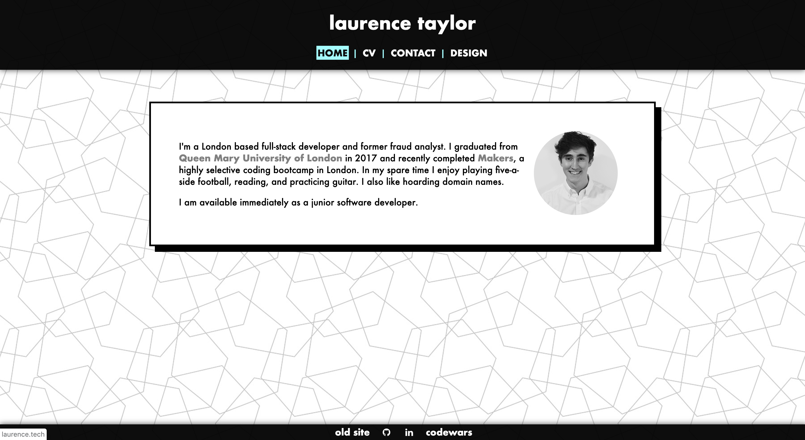
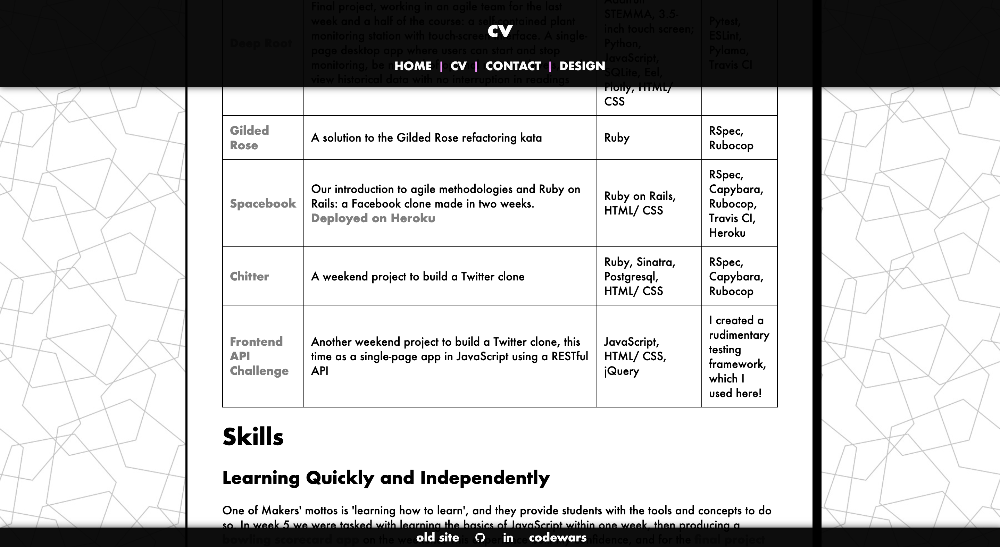
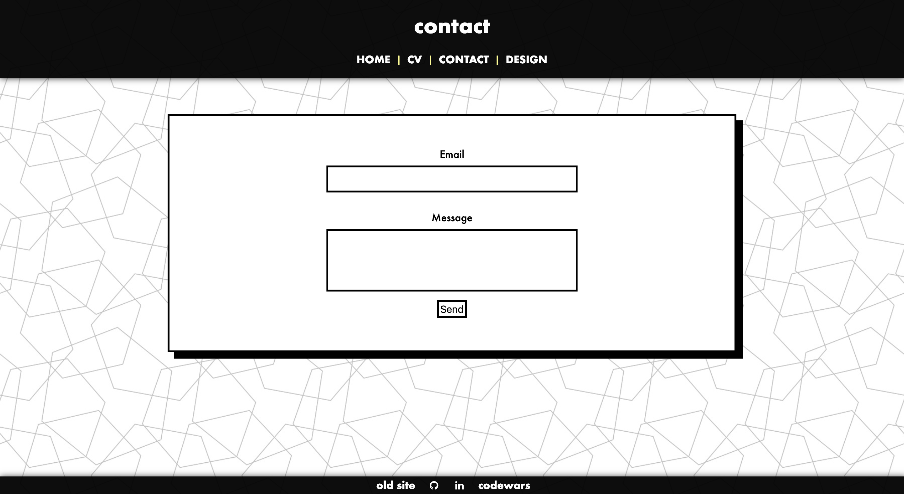

# Laurence Taylor Personal Site

## The Goal

* To build a clear, nicely designed website using unfamiliar technology.

* To practice styling a page from scratch.

## How to Use

* The site is available on [surge](http://wary-farm.surge.sh/), or (hopefully) at [laurence.tech](http://laurence.tech/). Alternatively:

* Clone this repository.

* Make sure you have [node](https://nodejs.org/en/download/) installed.

* Run `npm install` from your command line to install dependencies.

* Run `npm install -g gatsby-cli` to install the gatsby CLI.

* Run `gatsby develop`, then open a web browser and visit localhost:8000.

## Approach

* I was unfamiliar with Gatsby, and somewhat unfamiliar with ReactJS generally so this was a learning process for me. Luckily Gatsby is pretty easy to get started with.

* I didn't test for this project as there is no business logic. I could have feature tested, but given the simplicity of the site I preferred to check the page manually.

## Thoughts

* It would be nice to make the site more mobile-friendly. I'll try working on this next.

* I was really impressed by Gatsby, and I look forward to learning more about ReactJS/ working with it in future.

* The [laurence.tech](http://laurence.tech/) domain is working on some computers but not others. Will have to look into this. Also the Futura font isn't working on all devices.
